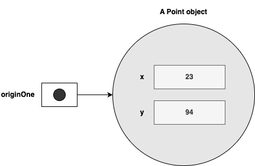
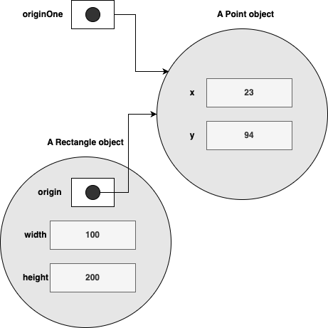

# Classes(클래스) and Objects(오브젝트)

이번 장에서는 클래스를 사용하여 오브젝트를 만드는 방법과 오브젝트를 사용하는 방법에 대해 배운다.

다음의 내용을 다룬다.

* Classes

  * Class의 구조, field, method 및 constructor(생성자)를 선언하는 방법에 대해 보여 준다.	

* Objects

  * 오브젝트를 만들고 사용하는 것에 대해 설명한다.
  * 오브젝트를 instance화하는 방법과 instance에 dot(.) 연산자를 사용하여 instance의 변수 및 method에 접근하는 방법을 배운다.

* More on Classes

  * 오브젝트 reference 와 dot 연산자를 사용한 보다 많은 클래스 활용에 대해 알아 본다.

* Nested Classes(중첩 클래스)

  * 정적 중첩 클래스, inner 클래스, anonymous inner 클래스, 로컬 클래스 및 lambda 식에 대해 알아 본다.

* Enum Types(열거형 타입)

  * 상수 집합을 정의하고 사용할 수 있는 특수 클래스인 열거형을 다룬다.

    

## Classes

본격적인 클래스 설명에 앞서 예로서 Bicycle 클래스를 보자.

~~~java
public class Bicycle {
        
    // the Bicycle class has
    // three fields
    public int cadence;
    public int gear;
    public int speed;
        
    // the Bicycle class has
    // one constructor
    public Bicycle(int startCadence, int startSpeed, int startGear) {
        gear = startGear;
        cadence = startCadence;
        speed = startSpeed;
    }
        
    // the Bicycle class has
    // four methods
    public void setCadence(int newValue) {
        cadence = newValue;
    }
        
    public void setGear(int newValue) {
        gear = newValue;
    }
        
    public void applyBrake(int decrement) {
        speed -= decrement;
    }
        
    public void speedUp(int increment) {
        speed += increment;
    }
        
}
~~~


그리고, 이를 확장한 MountainBike 클래스는 아래와 같다.

~~~java
public class MountainBike extends Bicycle {
        
    // the MountainBike subclass has
    // one field
    public int seatHeight;

    // the MountainBike subclass has
    // one constructor
    public MountainBike(int startHeight, int startCadence,
                        int startSpeed, int startGear) {
        super(startCadence, startSpeed, startGear);
        seatHeight = startHeight;
    }   
        
    // the MountainBike subclass has
    // one method
    public void setHeight(int newValue) {
        seatHeight = newValue;
    }   
}
~~~


### Declaring Cleasses (클래스 선언)

클래스 선언은 앞에서 본 것과 같이 필드와 생성자, method 등을 포함하여 정의하는 것이다.

~~~java
class MyClass {
  // field, constructor, and
  // method declarations
}
~~~

중괄로 표시되는 클래스 본문은 아래와 같이 클래스에서 생성된 오브젝트와 관련된 모든 코드가 포함되어 있다. 

* 새 오브젝트를 초기화 하기 위한 생성자
* 클래스 및 해당 오브젝트의 상태를 제공하는 필드에 대한 선언
* 해당 오브젝트의 동작을 구현하는  method


클래스가 완전히 새롭게 선언된 것이 아니라면 클래서 선언을 위해서는 더 많은 구성 요소들이 있을 것이다.

클래스가 다른 클래스로부터 확장되고, 특별한 인터페이스를 지원해야 한다면 아래와 같이 추가 정보가 필요할 것이다.

~~~java
class MyClass extends MySuberClass implements YourInterface {
  // field, constructor, and
  // method declarations
}
~~~

Myclass는 MySuberClass를 상속받아 구현되었고, YourInterface를 지원함으로써 관련된 type으로 사용될 수 있다.

또한, 클래스의 접근 권한과 관련된 modifier로서 public, private 등이  클래스, 필드 및 method  선언 앞에 올수 있음을 앞서 선언된 Bicycle 클래스나 MountainBike 클래스를 보면 알 수 있다.


일반적인 클래스 선언은 아래의 내용을 순차적으로 포함한다.

* public , private과 같은 나중에 접하게 될 기타  access modifier
* class keyword
* 첫 글자가 대문자인 클래스 이름
* 확장 클래스인 경우,  extends keyword 와 superclass 클래스의 이름 (superclass는 하나로 제한)
* 인터페이스 구현이 필요하다면, implements keyword와 하나 이상의 interface 이름이 쉽표로 구분되어 붙으며,
* 중괄호 {}로 둘러싸인 클래스 본문이 위치한다.

~~~java
<modifier> class <class name> [extends <superclass name>] [implements <interface name>, <interface name>,..] {
  // class body
}
~~~

**참고**

* Modifier는 뒤에서 설명함
* 추가적으로 static keyword가 붙을 수 있으나, 뒤에서 설명하도록 한다.


### Declaring Member Variables

클래스에서 선언 가능한 변수는 아래와 같다.

* 클래스 member 변수 (field)
* Method 또는 코드 block의 변수 (local variable)
* Mehtod 선언에서의 변수 (parameter)

Bicycle 클래스에서 필드 선언은 아래와 같다.

```java
public int cadence;
public int gear;
public int speed;
```


필드 선언에서도 클래스 선언에서와 마찬가지로 아래와 같은 구성 요소들이 순차적으로 포함된다.

* public 또는 private 과 같은 modifier(생략 가능)
* 필드 type
* 필드 이름


Bicycle 클래스의 필드들은 public modifier를 상용하고, int type으로 선언되었다.


#### Acccess Modifiers

필드 선언의 가장 왼쪽에 있는 modifier를 이용할 경우  다른 클래스에서 해당 필드의 접근을 제어할 수 있다.


Access modifier의 종류와 특징은 아래와 같다.

| Access Modifier | 같은 클래스 | 같은 패키지 | 다른 패키지에 있는 subclass | 다른 패키지 |
| :-------------: | :---------: | :---------: | :-------------------------: | :---------: |
|     public      |    가능     |    가능     |            가능             |    가능     |
|    protected    |    가능     |    가능     |            가능             |   불가능    |
|     default     |    가능     |    가능     |           불가능            |   불가능    |
|     private     |    가능     |   불가능    |           불가능            |   불가능    |

##### private

* 클래스에서만 접근 가능


예제로 확인해 보자. 

아래의 코드를 작성하라.

~~~java
// AccessModifierTest.java
package example;

class A{  
	private int data=40;  
	private void msg(){
    System.out.println("Hello java");
  }  
}  

public class AccessModifierTest {  
	public static void main(String[] args){  
    A obj=new A();  
    System.out.println(obj.data);
    obj.msg();
  }  
}  
~~~

클래스 A의 필드와 method는 access modifier를 private로 주어져 있다.

클래스 AccessModifierTest에 클래스 A의 instance생성하여 필드와 method에 접근하려 한다. 어떠한 결과가 나올까?


##### default

* 패키지 내부에서만 접근 가능

  

private 예제의 클래스 A를 아래와 같이 수정해 보자. 

~~~java
// A.java
package example;

class A{  
	int data=40;  
	void msg(){
    System.out.println("Hello java");
  }  
}  
~~~

두 파일을 compile하면 어떤 결과가 나오는가?


A.java 파일의 패키지를 바꿔보도록 한다.

example 패키지 대신 example2를 생성하고, 여기에 AccessModifierTest.java를 옮겨서 아래와 같이 수정한다.

~~~java
// AccessModifierTest.java
package example2;

import example.A;

public class AccessModifierTest {  
	public static void main(String[] args){  
    A obj=new A();  
    System.out.println(obj.data);
    obj.msg();
  }  
}  
~~~

Compile 결과는 어떠한가? 패키지를 분리하기 전과 동일한가?


##### protected

* 패지키 내부와 외부 모두 접근 가능할 수 있지만, 상속을 통해서만 가능


클래스 A의 access modifier를 아래와 같이 수정해 보자.

~~~java
// A.java
package example;

protected class A{  
	protected int data=40;  
	protected void msg(){
    System.out.println("Hello java");
  }  
}  
~~~


그리고, 클래스 A를 상속하여 아래와 같이 클래스 B를 만들어 보자.

~~~java
// B.java
package example;

protected class B extends A{  
}  
~~~


마지막으로 클래스 AccessModifierTest도 아래와 같이 수정해 보자.

~~~java
// AccessModifierTest.java
package example2;

import example.B;

public class AccessModifierTest {  
	public static void main(String[] args){  
    A obj=new B();  
    System.out.println(obj.data);
    obj.msg();
  }  
}  
~~~

Compile 결과는 어떠한가? default와 어떠한 차이가 있는가?


##### public

* 어디에서나 접근 가능


마지막으로 클래스 A와 클래스 B를 아래와 같이 수정해 보자.


~~~java
// A.java
package example;

public class A{  
	public int data=40;  
	public void msg(){
    System.out.println("Hello java");
  }  
}  
~~~


그리고, 클래스 A를 상속하여 아래와 같이 클래스 B를 만들어 보자.

~~~java
// B.java
package example;

public class B extends A{  
}  
~~~

Compile 결과는 어떠한가? protected와 어떠한 차이가 있는가?


필드는 access modifier의 종류에 따라 다양하게 접근을 허용하거나 제한 할 수 있지만, 해당 클래스 외부에서의 접근은 최소화 할 수 있도록 설정하는 것이 좋고, 접근이 필요한 경우에도 method 추가를 통해 지원하는 것이 좋다(encapsulation). 


위에서 선언한 Bicycle 클래스를 설명에 따라 수정해 보자.

~~~java
public class Bicycle {
        
    private int cadence; // 필드는 외부 접근을 차단할 수 있도록 private
    private int gear;    // 상속을 받는 subclass에서도 method를 이용해 접근 허용
    private int speed;
        
    public Bicycle(int startCadence, int startSpeed, int startGear) {
        gear = startGear;
        cadence = startCadence;
        speed = startSpeed;
    }
        
    public int getCadence() {            // 필드 접근을 위한 method 추가
        return cadence;
    }
        
    public void setCadence(int newValue) {
        cadence = newValue;
    }
        
    public int getGear() {
        return gear;
    }
        
    public void setGear(int newValue) {
        gear = newValue;
    }
        
    public int getSpeed() {
        return speed;
    }
        
    public void applyBrake(int decrement) {
        speed -= decrement;
    }
        
    public void speedUp(int increment) {
        speed += increment;
    }
}
~~~


#### Types

* 모든 변수는 type을 갖는다
* Primitive type
  * int, float, boolean, ...
* Reference type
  * array, string, class, interface,...


#### Variable Names

* Language Basics에서 설명한 규칙을 따른다

  

### Defining Methods

* Method 정의는 아래의 형식을 갖는다.

~~~java
[<access modifier>] [static] [final] <type> <method 이름> ([<parameter list>]) {
  // method body
}
~~~

* Type, method 이름, (), {} 는 필수 요소이다.
* Access modifier 는 앞서 설명한 것들중 하나를 선택하면 된다.
* Method를 클래스 method로 정의하고 싶을 경우, static keyword를 추가한다.
* Method가 하위 클래스에서 재정의 되는걸 원하지 않는다면 final keyword를 추가한다.
* Method에서 반환되는 데이터 type을 지정한다
* Method 이름을 정의한다.
* Method의 파라메터 목록을 추가하며, 파라메터가 없을 경우 () 만 추가한다.
* Method의 body를 추가한다.


#### Method Names

* Language Basics에서 설명한 이름 규칙을 따름
* 시작은 소문자
* 여러 단어로 구성될 경우, 공백없이 연결해 쓰면서 첫번째 단어를 제외한 나머지는 첫글자를 대문자로 표기

* 일반적으로 클래스 내에서는 같은 이름의 method가 존재하지 않지만, method overloading으로 인해 둘 이상 존재할 수 있다.

  * 단, method 이름과 parameter type을 합한 method signature가는 달라야 한다.

  

##### 예제. Method 이름 보기

~~~java
run
runFast
getBackground
getFinalData
compareTo
setX
isEmpty
~~~


#### Method Overloading

* 클래스 내에서 동일한 이름에 다른 parameter list를 가질 수 있음을 나타낸다.
* Method signature가 달라야 한다.

~~~java
public class DataArtist { 
    ... 
    public void draw(String s) { 
        ... 
    } 
    public void draw(int i) { 
        ... 
    } 
    public void draw(double f) { 
        ... 
    } 
    public void draw(int i, 더블 f) { 
        ... 
    } 
}
~~~

* 동일한 method 이름에 각기 다른 parameter  list를 사용함으로써 서로 다른 method signature를 가지고 있다고 할 수 있다.
* 반환 type은 method signature에 포함되지 않으므로, 반환 type만 다를 경우 ccompile에서 에러를 발생 시킨다.


### Providing Constructors for Your Classes

##### Constructor(생성자)

* 클래스에서 오브젝트를 생성시 호출되며
* 생성된 오브젝트를 초기화 하는 기능을 수행함
* 선언에 반환 type에 대한 정의는 없으며
* 생성자 body에서 결과 반환도 없다


 Bicycle의 생성자는 아래와 같다.

~~~java
  public Bicycle(int startCadence, int startSpeed, int startGear) {
      gear = startGear;
      cadence = startCadence;
      speed = startSpeed;
  }
~~~


프로그램에서 Bicycle의 새로운 오브젝트를 생성하려면 new 연산자를 이용해 생성자를 호출한다.

~~~java
Bicycle myBike = new Bicycle(30, 0, 8);
~~~


new 연산자를 myBike를 위한 메모리 공간을 할당하고, 생성자를 호출해 오브젝트를 초기화 한다.

 Bicycle 클래스에는 하나의 생성자만 정의되어 있지만, Java에서의 method overriding은 필요한 경우 추가적인 생성자를 정의할 수 있도록 지원한다.

다음은 Bicycle에 아무런 parameter가 없는 생성자를 정의한 것이다.

~~~java
  public Bicycle() {
      gear = 1;
      cadence = 10;
      speed = 0;
  }
~~~


프로그램에서는 아래와 같이 아무런 argument가 없이 호출 가능하다.

~~~java
Bicycle myBike = new Bicycle();
~~~


Bicycle에는 두개의 생성자가 있지만, parameter의 차이로 인해 method signature가 달라 적용이 가능하다.

동일한 parameter를 갖도록 정의한다면 compiler에서는 오류를 발생할 것이다.


##### Default Constructor

모든 클래스는 반드시 하나 이상의 생성자가 있어야 한다. 하지만, 종종 생성자가 정의되어 있지 않는 클래스를 볼 수 있다.

이는 Java에서 생성자가 정의되지 않을 경우, 기본 생성자를 제공하기 때문이다.

기본 생성자는 특별한 기능을 수행하지는 않고, 상속에 의해 생성된 subclass의 경우 superclass의 기본 생성자를 호출한다. 이때, superclass에서 기본 생성자가 없다면 compile 과정에서 오류가 발생할 것이다.

그리고, 클래스에 어떠한 생성자라도 하나 이상 정의되어 있을 경우, 기본 생성자는 제공되지 않는다.


##### 예제. MountainBike를 기본 생성자로 생성해 보자.

~~~java
package example;

public class DefaultConstructorTest {
  public static void main(String [] args) {
    MountainBike bike = new MountainBike();
  }
}
~~~

* Compile을 하면 어떻게 되나요? 이유는?
* MountainBike의 생성자를 주석 처리하고 다시 compile해 봅니다. 어떻게 되나요? 이유는?


### Passing information to a Method of a Constructor

* Method나 생성자에 대한 선언은 해당 method나 생성자에서 요구하는 argument의 수와 type을 선언한다.
* Parameter는 method나 생성자에서 변수로 사용되며, runtime에 전달되어 오는 argument를 초기 값으로 사용한다.


#### 예제. 다음 코드에서 parameter와 arguement를 구분해 설명하라

// TODO : 코드 및 내용 추가

~~~java
package example;


public class ParameterAndArgument {
  public static void main(String [] args) {
  }
}
~~~


#### Parameter Types

* Java에서 지원하는 모든 데이터 type 사용 가능

  

#### Arbitrary Number of Arguments

* Method의 parameter 갯수가 유동적일때, 임의 개수의 값 전달 가능


##### 예제. 임의 개수의 정수를 받아 출력하라. 

~~~java
package examples;

public class VariableArgumentTest {
    public VariableArgumentTest(int... numbers) {

        for(int number : numbers) {
            System.out.println(number);
        }
    }

    public static void main(String[] args) {
        VariableArgumentTest test = new VariableArgumentTest(1, 2, 3);
    }
}
~~~

예제는 생성자에서 임의 개수의 정수를 받아 출력한다. 

VariableArgumentTest 클래스의 생성자는 가변 parameter로 int type의 numbers를 선언하고, 생성자에서 numbers를 이용해 생성자 호출시 받은 argument를 배열로 저장하여 사용하고 있다.


많이 사용되고 있는 System.out.printf 도 보자.

~~~java
public PrintStream printf(String format, Object... args)
~~~

첫번째 parameter로 String type의 format이 선언되어 있고, 두번째 parameter로 Object type의 args가 가변 길이로 선언되어 있다.

실제 사용에서는 아래와 같이, 2개 이상의 argument를 줄 수 있다.

~~~java
System.out.printf("%s: %d, %s%n", name, idnum, address);
~~~


#### Parameter Names

* Parameter 이름은 method나 생성자 호출시 전달된 인수를 참조하기 위해 사용된다.
* 조금 더 상세히 보면, primitive type은 값을 복사하고, reference type은 해당 오브젝트를 참조할 수 있도록 지원한다.
* Parameter의 이름은 해당 method나 해당 생성자 내에서만 유효하다.
* Parameter의 이름이  클래스 필드와 중복되는 경우, 클래스 필드는 가려지게 되고 추가적인 방법을 통해서만 접근 가능하다.


 ~~~java
 package example;
 
 public class ShadowTest {
   private int x, y, radius;
   ShadowTest() {
     x = 0;
     y = 0;
     radius = 0;
   }
 
   public void setOrigin(int x, int y) {
     x = x;
     y = y;
   }
   
 
  public void setRadius(int r) {
     radius = r;
   }
 
   public int getX() {
     return x;
   }
   
   public int getY() {
     return	y;
   }
   
   public int getRadius() {
     return	radius;
   }
   
   public static void main(String [] args) {
     ShadowTest test = new ShadowTest();
     
     test.setOrigin(10, 10);
     test.setRadius(10);
     
     System.out.println("Origin : " + test.getX() + ", " + test.getY());
     System.out.println("Radius : " + test.getRadius());
   }
 }
 ~~~


##### 문제. 위 코드에서 문제를 확인하고 설명해 보자. (2분)

* 설정된 값과 출력된 값을 확인하라.


##### 문제. 위 코드는 동작에 문제가 있다. 수정하여 정상적으로 동작하게 하라. (2분)

* Shadowing  필드 해결을 위해서는 parameter의 이름을 변경하거나, 

* this  키워드를 사용해 해당 오브젝트가 가지고 있는 필드임을 명시할 수 있다.

  

#### Passing Primitive Data Type Arguments

* Primitive data type은 method에 값을 전달한다.
* 즉, parameter로 넘겨져 오는 것은 argument 값으로 method 호출시에 적용되었던 변수와는 관계가 없다.
* parameter는 수명 주기를 method와 함께 가지므로, method가 반환되면 method 내부에서 사용되던 parameter도 사라진다.


##### 예제. primitive data type을 method의 parameter로 사용하고, argument로 사용된 변수의 영향을 확인하라.

~~~java
public class PassPrimitiveByValue {

    public static void main(String[] args) {
           
        int x = 3;
           
        // invoke passMethod() with 
        // x as argument
        passMethod(x);
           
        // print x to see if its 
        // value has changed
        System.out.println("After invoking passMethod, x = " + x);
           
    }
        
    // change parameter in passMethod()
    public static void passMethod(int p) {
        p = 10;
    }
}
~~~

* x는 static method passMethod에 argument로 사용된다
* Parameter p는 x의 값으로 초기화된 후 method 내부에서 변경된다.
* passMethod 가 반환되고, x 값을 확인한다.


#### Passing Reference Data Type Arguments

* Reference data type은 method에 값을 전달한다.
* 즉, parameter로 넘겨져 오는 것은 argument 값으로 method 호출시에 적용되었던 오브젝트의 참조 정보이다.
* parameter는 수명 주기를 method와 함께 가지므로, method가 반환되면 method 내부에서 사용되던 parameter도 사라진다.

// TODO : 예제 보강

##### 예제. Reference data type을 method의 parameter로 사용하고, argument로 사용된 변수의 영향을 확인하라.

~~~java
public void moveCircle(Circle circle, int deltaX, int deltaY) {
    // code to move origin of circle to x+deltaX, y+deltaY
    circle.setX(circle.getX() + deltaX);
    circle.setY(circle.getY() + deltaY);
        
    // code to assign a new reference to circle
    circle = new Circle(0, 0);
}
~~~

* Parameter circle은 reference data type으로 moveCircle 호출시 argument로 사용된 오브젝트의 reference를 갖는다.
* moveCircle내베엇 circle의 method를 호출함으로써 상태를 변경한다.
  * 이때, circle은 argument 오브젝트의 reference이므로, argument 오브젝트가 수정된다.
* 마지막으로, circle은 새로운 Circle instance를 참조하도록 변경된다.
* moveCircle의 argument로 사용된 오브젝트는 어떻게 되었을까?

// TODO : 설명을 위한 그림이 추가되면 좋을 듯함


## Objects

* Java 프로그램은 method를 호출하여 상호 작용하는 많은 오브젝트 생성
* 오브젝트간 상호 작용을 통해 GUI 구현, animation 실행, network을 통한 정보 송수신 등의 다양한 작업 수행
* 오브젝트가 생성된 작업을 완료하면 해당 리소스는 다른 오브젝트에서 사용할 수 있도록 재활용됨


##### 예제. 오브젝트 설명을 위한 작은 프로그램이다. 작성하여 실행해 보라.

* X축과 Y축의 위치를 나타낼 Point 클래스는 아래와 같다.

~~~java
//Point.java
package example;

public class Point {
  public int x;
  public int y;
  
  public Point() {
    x = 0;
    y = 0;
  }
  
  public Point(int x, int y) {
    this.x = x;
    this.y = y;
  }
}
~~~

* 중심점, 넓이와 높이를 갖는 Rectangle 클래스는 아래와 같다.
* 영역 크기를 계산해 돌려주는 method를 지원한다.
~~~java
// Rectangle.java
package example;

public class Rectangle {
  public Point origin;
  public int width;
  public int height;
  
  public Rectangle(int width, int height) {
    this.origin = new Point();
    this.width = width;
    this.height = height;
  }
  
  public Rectangle(Point origin, int width, int height) {
    this.origin = origin;
    this.width = width;
    this.height = height;
  }
  
  public int getArea() {
    return	width * height;
  }
}
~~~

* 하나의 Point instance와 두개의 Rectangle instance를 생성하는 프로그램이다. 

~~~java
//CreateObjectDemo.java
package example;

public class CreateObjectDemo {

    public static void main(String[] args) {
		
        // Declare and create a point object and two rectangle objects.
        Point originOne = new Point(23, 94);
        Rectangle rectOne = new Rectangle(originOne, 100, 200);
        Rectangle rectTwo = new Rectangle(50, 100);
		
        // display rectOne's width, height, and area
        System.out.println("Width of rectOne: " + rectOne.width);
        System.out.println("Height of rectOne: " + rectOne.height);
        System.out.println("Area of rectOne: " + rectOne.getArea());
		
        // set rectTwo's position
        rectTwo.origin = originOne;
		
        // display rectTwo's position
        System.out.println("X Position of rectTwo: " + rectTwo.origin.x);
        System.out.println("Y Position of rectTwo: " + rectTwo.origin.y);
		
        // move rectTwo and display its new position
        rectTwo.move(40, 72);
        System.out.println("X Position of rectTwo: " + rectTwo.origin.x);
        System.out.println("Y Position of rectTwo: " + rectTwo.origin.y);
    }
}
~~~

결과는 아래와 같다.

~~~sh
Width of rectOne: 100
Height of rectOne: 200
Area of rectOne: 20000
X Position of rectTwo: 23
Y Position of rectTwo: 94
X Position of rectTwo: 40
Y Position of rectTwo: 72
~~~

* 동일한 결과가 나온다면 다음 진행을 위한 준비가 되었다.


### Create Objects

예제를 통해 아래와 같이 오브젝트를 생성해 보았다.

~~~java
Point originOne = new Point(23, 94);
Rectangle rectOne = new Rectangle(originOne, 100, 200);
Rectangle rectTwo = new Rectangle(50, 100);
~~~

각각의 라인은 아래의 세부분으로 구성된다.

1. 선언 : 생성할 오브젝트를 위한 type과 이를 연결한 변수 선언 
2. instance화 : new 연산자를 이용해 오브젝트 생성
3. 초기화 : 생성된 오브젝트를 초기화하기 위해 생성자 호출


#### Declaring a Variable to Refer to an Object

* 오브젝트 생성이 완료되면 이를 참조할 변수가 필요하다

* 앞서 변수 선언에서 본 것처럼 변수를 선언한다.

  ~~~java
  <type> <name>;
  ~~~

  * \<name>의 변수는 선언만 되어 있고, 
  * primitive type의 경우, 정해져 있는 초기값으로
  * reference type의 경우, null로 초기화 됨

* 변수가 선언되었다고 해서 오브젝트가 생성되는 것은 아니고, 새롭게 생성하거나 생성된 오브젝트를 참조하도록 해야 한다.

  ~~~java
  Point originOne = new Point();
  Point originTwo;
  
  originTwo = originOne;
  ~~~

  // TODO : 그림 추가

* 참조 타입의 경우, 변수 선언 후 오브젝트를 참조하기 전에 사용하면 compile 과정에서 오류가 발생한다.


##### 예제. 오브젝트 참조를 위해 사용되는 변수들에 대해 확인해 보자.

~~~java
package example;

public class CreateObjectDemo {
    public static void main(String[] args) {
        Point originOne;

        if (originOne instanceof Point) {
            System.out.println("Origin : " + originOne.x + ", " + originOne.y);
        }
    }
}
~~~

* Compile 과정에 문제는 없는가? 이유는?


#### Instantiating a Class

##### new 연산자

* 오브젝트를 위한 메모리 할당
* 오브젝트 생성자 호출을 통한 초기화
* 생성된 오브젝트의 reference 반환 
  * 반환의 의미가 변수에 대입하기 위한 용도를 나타내는 것은 아님


#### Initializing an Object

* new 연산자를 통해 생성 오브젝트 초기화
* new 연산자 호출시 주어진 argument를 이용해 적절한 생성자 호출
* argument type과 parameter type이 일치하지 않을 경우, 호환 가능한 parameter type을 찾아 적용


몇가지 예를 통해서 instance 생성과 초기화 과정을 보도록 하자.

##### 예제. Point 오브젝트 생성을 보자.

~~~java
Point originOne = new Point(23, 94);
~~~



Rectangle 오브젝트 생성을 보자.

Point는 필드로 primitive data type만을 가지는 반면에 Rectangle은 Point를 갖는다.


Rectangle 클래스는 아래와 같다.

~~~java
public class Rectangle {
    public int width = 0;
    public int height = 0;
    public Point origin;

    // four constructors
    public Rectangle() {
        origin = new Point(0, 0);
    }
    public Rectangle(Point p) {
        origin = p;
    }
    public Rectangle(int w, int h) {
        origin = new Point(0, 0);
        width = w;
        height = h;
    }
    public Rectangle(Point p, int w, int h) {
        origin = p;
        width = w;
        height = h;
    }

    // a method for moving the rectangle
    public void move(int x, int y) {
        origin.x = x;
        origin.y = y;
    }

    // a method for computing the area of the rectangle
    public int getArea() {
        return width * height;
    }
}
~~~

* Rectangle 기준점을 Point  사용
* 폭과 높이는 Primitive data type의 width, height으로 선언
* width, height은 기본값 제공
* 여러 종류의 parameter 구성으로 다양한 생성자 구성


각 생성자를 예로 들어 보자.


##### 예제. Point 오브젝트, 폭 및 높이를 받는 생성자를 확인해 보자.

생성자를 사용하는 코드는 아래와 같다.

~~~java
Rectangle rectOne = new Rectangle(originOne, 100, 200);
~~~


new 연산자는 Rectangle 오브젝트를 위한 메모리를 할당 받고, 생성자 중 주어진 argument를 처리할 수 있는 생성자를 호출한다.

이를 통해 생성된 오브젝트의 구성은 아래 그림과 같다.




##### 예제. 폭과 높이만을 받는 생성자를 확인해 보자.

생성자를 사용하는 코드는 아래와 같다.

~~~java
Rectangle rectTwo = new Rectangle(50, 100);
~~~

앞에서와 동일하게 new 연산자는 메모리를 할당 받는다. Rectangle 오브젝트를 위한 argument로 폭과 높이만을 주었으므로, 생성자중 폭과 높이만을 받아 처리하는 생성자를 호출한다.

~~~java
public Rectangle(int w, int h) {
    origin = new Point(0, 0);
    width = w;
    height = h;
}
~~~

 생성자에서는 argument로 폭과 높이만 주어졌으므로, Rectangle 오브젝트의 위치를 나타낼 Point 오브젝트를 생성한다.


##### 예제. Argument를 받지 않는 생성자를 확인해 보자.

마지막으로 아무런 argument를 받지 않는 생성자(no-argument constructor)를 보자.

아무런 argument를 받지 않는 생성자는 기본 생성자(default constructor)와 동일하게 생겼다. 하지만, Rectangle 클래스에서는 필드에 대한 초기화가 필요하고, 각 필드의 초기값이 자동으로 설정되지 않은 reference type이 존재하므로 자동을 생성하는 기본 생성자 사용이 불가능하다. 아울러 기본 생성자는 아무런 생성자가 존재하지 않을때만 자동으로 생성되어 argument를 받지 않는 생성자 구성이 필요하다.

코드는 아래와 같다.

~~~java
Rectangle rect = new Rectangle();
~~~


##### 상속 클래스에서의 초기화

상속을 통해서 생성된 클래스의 경우 생성자 호출시 superclass의 생성자를 자동 또는 수동으로 호출한다. 생성되는 클래스의 생성자에서 명시적으로 superclass의 생성자를 호출하지 않은 경우, 생성자 시작부분에서 superclass의 기본 생성자를 자동 호출한다.

따라서, 이때 superclass의 기본 생성자가 없다면 compile 과정에서 오류가 발생할 것이다.


##### 예제. MountainBike를 수정하여 superclass의 기본 생성자 호출을 확인하자.

MountainBike 클래스를 아래와 같이 생성자를 추가한다.

~~~java
package example;

public class MountainBike extends Bicycle {
        
    // the MountainBike subclass has
    // one field
    public int seatHeight;

    public MountainBike(int startHeight) {
        seatHeight = startHeight;
    }   

    public MountainBike(int startHeight, int startCadence,
                        int startSpeed, int startGear) {
        super(startCadence, startSpeed, startGear);
        seatHeight = startHeight;
    }   
        
    // the MountainBike subclass has
    // one method
    public void setHeight(int newValue) {
        seatHeight = newValue;
    }   
}
~~~


추가된 생성자를 이용해 초기화 될 수 있도록 테스트 코드를 작성한다.

~~~java
package example;

public class InitSuperclassDemo {
  public static void main(String [] args) {
    MountainBike bike = new MounttainBike(10);
    
  }
}
~~~

Compile 결과는? 이유는?


// TODO : 문제 추가


### Using Objects

오브젝트를 이용한 작업은 

* 필드 값을 사용하거나 변경
* method를 호출


 #### Referencing an Object's Fields

오브젝트 필드는 

* 이름으로 접근되어 모호하지 않은 이름 사용

  ~~~java
  class Rectangle {
    int width;
    int height;
    
    ...
      
    public void printInformation() {
      System.out.println("Width and height are:" + width + ", " + height);
    }
  }
  ~~~

  * 이름만 보고 의미를 알 수 있는 것이 가장 좋다

  ~~~java
  class Rectangle {
    int a;
    int b;
    
    ...
      
    public void printInformation() {
      System.out.println("Width and height are:" + a + ", " + b);
    }
  }
  ~~~

  * a? b? 무엇은 뜻하는지 알수 없다

* 클래스 밖에 있는 코드가 필드를 참조하기 위해서는 dot(.) 연산자 사용

  ~~~java
  class CreateObjectDemo {
    public static void main(String[] args) {
      Rectangle rectOne = new Rectangle(); 
      Rectangle rectTwo = new Rectangle();
      
   		System.out.println("Width of rectOne: "  + rectOne.width);
  		System.out.println("Height of rectOne: " + rectOne.height);   
  
   		System.out.println("Width of rectTwo: "  + rectTwo.width);
  		System.out.println("Height of rectTwo: " + rectTwo.height);   
    }
  }
  ~~~

  * Dot 연산자를 이용해 오브젝트 필드 참조
  * rectOne.width와 rectTwo.width는 오브젝트가 다르므로 서로 다른 width가 됨

* 오브젝트 참조를 위한 변수가 없어도 접근 가능

  ~~~java
  int height = new Rectangle().height;
  ~~~

  * new 연산자에 의해 오브젝트 생성되어 반환
  * 반환된 오브젝트의 height 필드 참조 
  * 생성된 오브젝트는 더 이상의 참조가 없으므로, 자원 재활용 

  

#### Calling an Object's Methods

오브젝트 method는

* Method가 수행하는 작업을 알 수 있도록 이름 사용

  ~~~java
  Rectangle rectOne = new Rectangle(100, 50, 10);
  
  rectOne.move(40, 70);
  int areaOfRactangle = rectOne.getArea();
  ~~~

  * void move(int x, int y) - rectOne 오브젝트를 특정 위치(x, y)로 이동
  * int getArea(); - rectOne의 width와 height를 이용해 계산한 영역 크기 

* 필드와 동일하게 dot 연산자를 이용해 호출 가능

  ~~~java
  rectOne.move(40, 70);
  ~~~

  * rectOne 오브젝트에서 지원하는 method 중에서 move를 호출

* 필드와 동일하게 오브젝트 참조 변수가 없이도 접근 가능

  ~~~java
  int areaOfRactangle = new Rectangle(100, 50).getArea();
  ~~~

  * new Rectangle(100, 50)을 통해 오브젝트가 생성되고, 생성된 오브젝트에 dot 연산자를 적용해 method를 호춣
  * Reference type 변수는 변수 그 자체가 오브젝트를 나타낸 것은 아니고, 오브젝트를 참조만 하고 있다.


#### The Garbage Collector

* Java runtime 환경에서 더 이상 사용되지 않는 오브젝트는 자동으로 삭제
* 더 이상 사용되지 않는 오브젝트란 더 이상 참조가 없다는 것으로 Reference type 변수나 dot 연산자 등의 해당 오브젝트와의 관계가 없다는 뜻
* 참조가 없을때 즉시 리소스 반환을 하지는 않고, 일정 조건(시간 간격)을 만족할때 자동 수행된다.

* **보다 자세한 내용은 특강에서 진행**


## More on Classes

아래의 내용에 대해 더 많은 것을 확인해 보자.

* Method에서의 값 반환
* this keyword
* Class member 대 instance member
* Access control(접근 제어)


### Returning a Value from a Method

Method에서 자신을 호출한 코드로 반환되는 것은 

* method의 수행이 완료되었을때
* 중간에서라도 return문을 만났을때
* 발생한 exception을 처리하지 못하거나 exception을 던졌을때


Method 반환 type은

* Method 선언시 지정
* 반환 값이 없는 경우 void로 선언
* return문을 통해 반환 되는 값의 type과 같아야 한다


return 문은

* Method내의 제어 흐름을 즉시 종료할 수 있고

  ~~~java
  int method(int n) {
   	if (n % 2 == 0) {
      retuirn	0;
    }
    ...
      
    return 1;
  }
  ~~~

* Method의 수행 결과는 반환할 수 있으나, method 선언에서 지정된 type이어야 하며

  ~~~java
  <type> method() {
    ...
      return	<type>;
  }
  ~~~

  다른 경우는 안된다.

  ~~~java
  boolean isValid() {
    return	1;  // 정수로서 boolean 값이 될 수 없다
  }
  ~~~

* Method에서 지정된 반환 type이 void인 경우, 반환 값 없이 호출할 수 있다.

  ~~~java
  void method() {
    ...
    return;
  }
  ~~~

* 변수의 값이나 상수 뿐만 아니라 식의 계산 값도 가능

  ~~~java
  int getArea() {
    return	width * height;
  }
  ~~~


#### Returning a Class or Interface

* Primitive data type뿐만 아니라 reference type 값도 반환 가능


// TODO : covariant return type 설명 추가


### Using the this Keyword

this는

* Instance mthod 또는 생성자 내에서 현재의 오브젝트를 참조하기 위해 사용
* 클래스의 외부 코드에서는 access modifier에 따라 접근 가능이 결정되지만, this는 해당 인스턴스나 생성자내에서 오브젝트의 모든 멤버들 참조 가능

#### Using this with a Field

this keyword를 사용하는 대표적인 예가 생성자이다.

앞서 parameter 이름을 설명하며, 이름 중복에 따른 shadowing 필드에 대해 보았다. 

아래의 예를 다시 보자.

~~~java
public class Point {
    public int x = 0;
    public int y = 0;
        
    //constructor
    public Point(int a, int b) {
        x = a;
        y = b;
    }
}
~~~

Point 클래스가 정의되었다. 생성자에서 x와 y의 초기 설정을 위해 두개의 값을 받으며 이름을 a, b라고 설정하였다.

a,b는 무엇을 의미하는지 이름으로 알 수 없어 이름을 정하는 규칙을 따르지 않았다.

이를 알기 쉽게 x, y로 변경해 보자.

~~~java
public class Point {
    public int x = 0;
    public int y = 0;
        
    //constructor
    public Point(int x, int y) {
        x = x;
        y = y;
    }
}
~~~

필드의 이름과 parameter의 이름이 동일해져 shadowing 현상이 발생하였다. 

this keyword를 이러한 문제에서 어느 변수가 필드인지 명확하게 표시할 수 있다.

~~~java
public class Point {
    public int x = 0;
    public int y = 0;
        
    //constructor
    public Point(int x, int y) {
        this.x = x;
        this.y = y;
    }
}
~~~


#### Using this with a Constructor

생성자를 작성하다보면 parameter의 구성에 따라 여러 생성자를 선언해야 할때가 있다.

이러한 경우, 필요 이상으로 동일한 코드가 많이 발생하게되는데, 이를 해결하기 위해  **explicit constructor invocation(명시적 생성자 호출)**을 지원한다.

명시적 생성자 호출이란 new 연산자를 통해서 메모리 할당 과정과 생성자 호출을 함께 하는 것이 아니라, 코드내에서 직접 생성자를 호출하는 것이다.

이때 코드는 자신의 생성자를 호출하기 this keyword사용이 가능하다.

##### 예제. Explicit constructor invocation을 이용해 중복 코드를 제거하라

~~~java
public class Rectangle {
    public int width = 0;
    public int height = 0;
    public Point origin;

    // four constructors
    public Rectangle() {
      	this(new Point(0, 0), 0, 0);

    }
    public Rectangle(Point p) {
      	this(p, 0, 0);
    }
  
    public Rectangle(int w, int h) {
      	this(new Point(0, 0), w, h);
    }

    public Rectangle(Point p, int w, int h) {
        origin = p;
        width = w;
        height = h;
    }

    // a method for moving the rectangle
    public void move(int x, int y) {
        origin.x = x;
        origin.y = y;
    }

    // a method for computing the area of the rectangle
    public int getArea() {
        return width * height;
    }
}
~~~


Rectangle 클래스를 수정해 보았다.

4개의 생성자중 3개는 explicit constructor invocation를 사용하여 작성하였다.

이로서 중복 코드는 제거되었고, 중복 코드로 인해 수정시 부분 수정에 따른 오류 발생의 가능을 줄였다.


### Controlling Access to Members of a Class

Access control의 수준

* Top level (class level)

  * public 
    * 동일 패키지에 상관없이 접근 가능
  * package-private
    * 동일 패키지 내에서만 접근 가능
    * public으로 설정하지 않은 경우로 별도의 keyword 없음

* Member level

  * public

    * 모든 경우 접근 가능

  * protected

    * 다른 패키지이며 상속 관계가 없는 경우를 제외하고 모두 접근 가능

  * default

    * 동일 패키지 내에서만 허용

  * private

    * 동일 클래스 필드나 method에 대해서만 허용


// TODO : Access Modifier는 앞에서 설명함. 여기로 가져 올지는 고민 중


##### Access Level 선택 기준

* 가장 제한적인 단계를 기본으로 사용
* 상수를 제외하고, 가능한 public은 사용하지 않도록 함
  * 앞서 사용된 public 필드는 단계적 설명을 위해 사용된 것
  * 외부에서의 직접적인 필드 사용은 코드의 유연성에 제약을 주게 됨 

​     

### Understanding Class Members

* static keyword의 활용
* Instance member vs class member


#### Class Variables

* 클래스에서 instance가 만들어지면 각 필드는 클래스에서 선언한 필드의 복사본

* Instance마다 별도의 메모리 영역을 할당하여 각기 다른 변수로 만들어짐


##### static keyword의 활용

* 같은 클래스로 만들어진 오브젝트간에 공통으로 사용이 필요한 변수가 필요한 경우
* static keyword가 적용된 변수를 static 필드 또는 클래스 변수라고함
* 개별 오브젝트와의 연결관계를 가지지 않고, 클래스와의 연결 관계를 가짐
* 해당 클래스로 부터 생성된 오브젝트를 통해서도 접근 가능하지만,
* 클래스만을 이용해서도 접근 가능하여 access modifier에 따라 별도의 오브젝트 생성 없이도 접근 가능 
* 클래스 변수에  dot 연산자를 이용해 접근할 것을 권장함


##### 예제. 자전거에 id를 두고, static field를 이용해 자전거가 생성될때 마다 새로운 id를 설정하라.

~~~java
public class Bicycle {
        
    private int cadence;
    private int gear;
    private int speed;
    private int id;
    private static int numberOfBicycles = 0;
        
    public Bicycle(int startCadence, int startSpeed, int startGear){
        gear = startGear;
        cadence = startCadence;
        speed = startSpeed;

        // increment number of Bicycles
        // and assign ID number
        id = ++numberOfBicycles;
    }

    // new method to return the ID instance variable
    public int getID() {
        return id;
    }
        ...
}
~~~

* static 필드로 numberOfBicycles를  선언
* 생성자를 통해 자전거가 생성될때마다 numberOfBicycles를 증가 시킴
* numberOfBicycles를 id로 사용함으로써, 중복된 id 없이 자전거 id 부여


#### Class Methods

* 클래스 변수와 마찬가지로 클래스 method 지원
*  클래스 이름에 dot 연산자를 사용해 호출하는 것을 권자함
  * 오브젝트에 dot 연산자 적용도 가능함
* 클래스 method이므로 method내에서 this 사용 불가
  *  즉, 클래스 method에서는 오브젝트의 변수나 method의 직접적인 접근이 불가능하다


// TODO : 예제 추가


#### Constants

* 클래스 변수중 final이 적용된 변수
* 이름은 대문자만으로 구성을 권장함
* 이름에 둘이상의 단어 조합 필요한 경우, 밑줄(_)을 사용
* compile time constant 란? // TODO : 확인

~~~java
class Math {
	static final double PI = 3.141592653589793;
	...
}
~~~


#### 현재까지의 내용을 적용한  Bicycle Class

~~~java
public class Bicycle {
        
    private int cadence;
    private int gear;
    private int speed;
        
    private int id;
    
    private static int numberOfBicycles = 0;

        
    public Bicycle(int startCadence,
                   int startSpeed,
                   int startGear) {
        gear = startGear;
        cadence = startCadence;
        speed = startSpeed;

        id = ++numberOfBicycles;
    }

    public int getID() {
        return id;
    }

    public static int getNumberOfBicycles() {
        return numberOfBicycles;
    }

    public int getCadence() {
        return cadence;
    }
        
    public void setCadence(int newValue) {
        cadence = newValue;
    }
        
    public int getGear(){
        return gear;
    }
        
    public void setGear(int newValue) {
        gear = newValue;
    }
        
    public int getSpeed() {
        return speed;
    }
        
    public void applyBrake(int decrement) {
        speed -= decrement;
    }
        
    public void speedUp(int increment) {
        speed += increment;
    }
}
~~~


### Initializing Fields

* 클래스나 인스턴스에서 필드 초기화 방법은 다양하게 제공됨
  * 변수 선언과 초기화
  * static 초기화 블록
  * 인스턴스 멤버 초기화


##### 변수 선언과 초기화

* 변수의 선언에서 초기값 제공

  ~~~java
  public class BedAndBreakfast {
  
      // initialize to 10
      public static int capacity = 10;
  
      // initialize to false
      private boolean full = false;
  }
  ~~~

* 클래스 변수나 인스턴스 변수에 대해 동일하게 적용

  * capacity는 클래스 변수의 초기화
  * full은 인스턴스 변수의 초기화

* 문제점

  * 고정된 단순 초기화만 가능
  *  오류 처리 불가

##### 정적 초기화 블록

* static keyword로 블록을 설정하여 초기화

  ~~~java
  static {
    // 초기화 코드
  }
  ~~~

* 클래스 임의의 위치서 생성 가능

* 여러개의 정적 초기화 블록이 설정 가능하며, 소스 코드에 나타나는 순서대로 호출됨을 보장


##### 클래스 method를 이용한 초기화

* 정적 초기화 블록 대신 private 클래스 method를 정의한 후 클래스 변수 선언시 호출

  ~~~java
  class Whatever {
      public static varType myVar = initializeClassVariable();
          
      private static varType initializeClassVariable() {
  
          // initialization code goes here
      }
  }
  ~~~


##### Instance member 초기화

* 일반적으로 생성자에서 instance 변수 초기화

* static 초기화 블록과 유사하게 초기화 블록 설정으로 초기화 가능 (static keyword 사용하지 않음)

* final method를 이용한 초기화

  ~~~java
  class Whatever {
      private varType myVar = initializeInstanceVariable();
          
      protected final varType initializeInstanceVariable() {
  
          // initialization code goes here
      }
  }
  ~~~

  * subclass에서 상속후 재정의가 불가능하지만, superclass의 초기화를 호출하여 초기화 가능


### Summary of Creating and Using Classes and Object

// TODO : 다시 확인

 

## Nested Classes(중첩 클래스)

* 클래스 내에 정의되는 클래스

  ~~~java
  class OuterClass {
      ...
      class NestedClass {
          ...
      }
  }
  ~~~

* Non-static 클래스는 외부 클래스의 일부로서 외부 클래스의 멤버에 접근할 수 있음(멤버에 대한 접근 제어 수준에 상관없음)

* static 클래스는 외부 클래스의 멤버 접근이 불가능하다. 다만, 클래스임에도 불구하고 접근 제어 수준이 public과 기본 뿐만 아니라 protected, private도 지원함


**중첩 클래스를 사용하는 이유**

* 한 곳에서만 사용되는 클래스를 논리적으로 그룹화하는 방법 -  클래스가 다른 하나의 클래스에만 유용하면 해당 클래스에 포함시켜 두 개를 함께 유지하는 것이 논리적이고, "도우미 클래스"를 중첩하면 패키지가 더욱 간소화된다.
* 캡슐화 향상 -  두두 개의 최상위 클래스인 A와 B를 예로 들어보자. 여기서 B는 비공개로 선언될 수 있는 A의 멤버에 액세스해야 한다. 클래스 A 내에서 클래스 B를 숨김으로써, A의 멤버들은 비공개로 선언될 수 있고, B는 그들에 접근할 수 있다. 게다가, B 그 자체는 외부 세계로부터 숨길 수 있다.
* 더 읽기 쉽고 유지 관리 가능한 코드로 이어질 수 있다 - 최상위 클래스 내에 작은 클래스를 중첩하면 코드가 사용되는 위치에 더 가깝게 배치된다.


#### Inner Classes(내부 클래스)

* 내부 클래스를 둘러싸고 있는 외부 클래스의 일부

* 외부 클래스 멤버 접근 가능

* 외부 클래스의 인스턴스 내에서만 존재할 수 있으므로, 정적 멤버 정의 불가능

  ~~~java
  class OuterClass {
      ...
      class InnerClass {
          ...
      }
  }
  ~~~

* 외부 클래스로 부터 생성된 오브젝트에서 내부 클래스 생성

* 외부 클래스의 멤버를 명시적으로 접근할 필요가 있을 경우, this 앞에 클래스 이름을 붙여서 사용


##### 예제. 내부 클래스를 정의하고, 내부 클래스의 생성과 외부 클래스의 멤버 접근에 대해 확인해 보자.


  ~~~java
  package example;
  
  public class OuterClass {
      class InnerClass {
          class DoubleInnerClass {
              int value;
  
              DoubleInnerClass(int v) {
                  value = v + OuterClass.this.value;
              }
          }
  
          int value;
          DoubleInnerClass doubleInnerClass;
  
          InnerClass(int v) {
              doubleInnerClass = InnerClass.this.new DoubleInnerClass(v);
              value = v + OuterClass.this.value + InnerClass.this.value;
          }
      }
  
      int value;
      InnerClass innerClass;
  
      OuterClass(int v) {
          value = v;
          innerClass = new InnerClass(value + 1);
      }
  
      public int getValue() {
          return  value;
      }
  
      public int getInnerValue() {
          return  innerClass.value;
      }
  }
  ~~~

* OuterClass의 생성자에서 InnerClass 인스턴스 생성
* InnerClass의 생성자에서 DoubleInnerClass 인스턴스 생성
* 내부 클래스 생성시 new는 외부 클래스 오즈젝트의 new
* 외부 클래스 오브젝트 멤버 접근을 위해서는 <외부 클래스 이름>.this로 접근 가능
  * 이름이 중첩되지 않을때는 생략 가능


#### Static Nested Classes(정적 중첩 클래스)

* 클래스의 static 멤버와 동일하게 외부 클래스의 static 멤버에 대해 접근 가능
* 외부 클래스의 인스턴스 멤버에 대해서는 일반 클래스와 동일하게 access level에 따라 접근 가능
* 일반 클래스와 동일한 방식으로 오브젝트 생성


##### 예제. 중첩 클래스에 대한 예를 보고, 생성 및 멤버 접근에 대해 확인해 보자. 

~~~java
//OuterClass.java
public class OuterClass {

    String outerField = "Outer field";
    static String staticOuterField = "Static outer field";

    class InnerClass {
        void accessMembers() {
            System.out.println(outerField);
            System.out.println(staticOuterField);
        }
    }

    static class StaticNestedClass {
        void accessMembers(OuterClass outer) {
            // Compiler error: Cannot make a static reference to the non-static
            //     field outerField
            // System.out.println(outerField);
            System.out.println(outer.outerField);
            System.out.println(staticOuterField);
        }
    }

    public static void main(String[] args) {
        System.out.println("Inner class:");
        System.out.println("------------");
        OuterClass outerObject = new OuterClass();
        OuterClass.InnerClass innerObject = outerObject.new InnerClass();
        innerObject.accessMembers();

        System.out.println("\nStatic nested class:");
        System.out.println("--------------------");
        StaticNestedClass staticNestedObject = new StaticNestedClass();        
        staticNestedObject.accessMembers(outerObject);
        
        System.out.println("\nTop-level class:");
        System.out.println("--------------------");
        TopLevelClass topLevelObject = new TopLevelClass();        
        topLevelObject.accessMembers(outerObject);                
    }
}  
~~~


~~~~java
// TopLevelClass.java
public class TopLevelClass {

    void accessMembers(OuterClass outer) {     
        // Compiler error: Cannot make a static reference to the non-static
        //     field OuterClass.outerField
        // System.out.println(OuterClass.outerField);
        System.out.println(outer.outerField);
        System.out.println(OuterClass.staticOuterField);
    }  
}
~~~~

결과는 아래와 같다.

~~~sh
Inner class:
------------
Outer field
Static outer field

Static nested class:
--------------------
Outer field
Static outer field

Top-level class:
--------------------
Outer field
Static outer field
~~~


**확인하기**

* InnerClass의 access modifier level을 public으로 수정하고, OuterClass의 외부에서 생성해 보자. 

* OuterClass 오브젝트내에서 StaticInnerClass의 인스턴스를 생성하고, OuterClass 오브젝트의 instance 변수를 참조해 보자.

// TODO : 추가 


#### Shadowing

* 내부 클래스나 method에서 외부 클래스등의 멤버 등과 동일한 이름을 가질 경우, 외부 클래스의 멤버의 이름이 가려져 접근이 되지 않는다.

  ~~~java
   public class ShadowTest {
  
      public int x = 0;
  
      class FirstLevel {
  
          public int x = 1;
  
          void methodInFirstLevel(int x) {
              System.out.println("x = " + x);
              System.out.println("this.x = " + this.x);
              System.out.println("ShadowTest.this.x = " + ShadowTest.this.x);
          }
      }
  
      public static void main(String... args) {
          ShadowTest st = new ShadowTest();
          ShadowTest.FirstLevel fl = st.new FirstLevel();
          fl.methodInFirstLevel(23);
      }
  }
  ~~~

  

* this를 이용해 접근 가능

* 내부 클래스에서는 <외부 클래스 이름>.this 를 이용해 접근 가능


#### Serialization

// TODO : serialization과 연관하여 내용 작성 필요


### Inner Class Example

* 


### Local Classes

// TODO : capture variables에 대한 설명 추가

#### Declaring Local Classes

* 모든 블록에서 정의 가능

~~~java
public class LocalClassExample {
  
    static String regularExpression = "[^0-9]";
  
    public static void validatePhoneNumber(
        String phoneNumber1, String phoneNumber2) {
      
        final int numberLength = 10;
        
        // Valid in JDK 8 and later:
       
        // int numberLength = 10;
       
        class PhoneNumber {
            
            String formattedPhoneNumber = null;

            PhoneNumber(String phoneNumber){
                // numberLength = 7;
                String currentNumber = phoneNumber.replaceAll(
                  regularExpression, "");
                if (currentNumber.length() == numberLength)
                    formattedPhoneNumber = currentNumber;
                else
                    formattedPhoneNumber = null;
            }

            public String getNumber() {
                return formattedPhoneNumber;
            }
            
            // Valid in JDK 8 and later:

//            public void printOriginalNumbers() {
//                System.out.println("Original numbers are " + phoneNumber1 +
//                    " and " + phoneNumber2);
//            }
        }

        PhoneNumber myNumber1 = new PhoneNumber(phoneNumber1);
        PhoneNumber myNumber2 = new PhoneNumber(phoneNumber2);
        
        // Valid in JDK 8 and later:

//        myNumber1.printOriginalNumbers();

        if (myNumber1.getNumber() == null) 
            System.out.println("First number is invalid");
        else
            System.out.println("First number is " + myNumber1.getNumber());
        if (myNumber2.getNumber() == null)
            System.out.println("Second number is invalid");
        else
            System.out.println("Second number is " + myNumber2.getNumber());

    }

    public static void main(String... args) {
        validatePhoneNumber("123-456-7890", "456-7890");
    }
}
~~~


##### Accessing Members of an Enclosing Class

* 로컬 클래스를 둘러싸고 있는 클래스 멤버에 접근 가능

* 로컬 클래스가 정의된 블록의 final 변수(로컬 변수, parameter) 또는 effective final 변수에 접근 가능

  * effective final 변수란 값이 초기화된 후에 변경되지 않는 변수

* 초기값 설정 이후 변경될 경우, effective final 변수가 될 수 없음

  ~~~java
  PhoneNumber(String phoneNumber) {
      numberLength = 7;
      String currentNumber = phoneNumber.replaceAll(
          regularExpression, "");
      if (currentNumber.length() == numberLength)
          formattedPhoneNumber = currentNumber;
      else
          formattedPhoneNumber = null;
  }
  ~~~

  * numberLengrth는 초기화 이후 phoneNumber 생성자에서 값의 변경이 있으므로, effective final 변수가 될 수 없음
  * compile시 오류 발생

###### Shadowing and Local Classes

* 일반 생성자, 메소드 및 중첩 클래스에서와 동일한 규칙 적용


#### Local Classes, Inner Classes, Static Inner Classes

// TODO : 표와 예제 추가

|                      |      |      |      |
| -------------------- | ---- | ---- | ---- |
| Local Classes        |      |      |      |
| Inner Classes        |      |      |      |
| Static Inner Classes |      |      |      |
| Local Interface      |      |      |      |
| Inner Interface      |      |      |      |


### Anonymous Classes

* 클래스 이름이 없는 Local class


#### 예제. 아래의 코드를 보고 anonymous class에 대해 답해 보자.

~~~java
public class HelloWorldAnonymousClasses {
  
    interface HelloWorld {
        public void greet();
        public void greetSomeone(String someone);
    }
  
    public void sayHello() {
        
        class EnglishGreeting implements HelloWorld {
            String name = "world";
            public void greet() {
                greetSomeone("world");
            }
            public void greetSomeone(String someone) {
                name = someone;
                System.out.println("Hello " + name);
            }
        }
      
        HelloWorld englishGreeting = new EnglishGreeting();
        
        HelloWorld frenchGreeting = new HelloWorld() {
            String name = "tout le monde";
            public void greet() {
                greetSomeone("tout le monde");
            }
            public void greetSomeone(String someone) {
                name = someone;
                System.out.println("Salut " + name);
            }
        };
        
        HelloWorld spanishGreeting = new HelloWorld() {
            String name = "mundo";
            public void greet() {
                greetSomeone("mundo");
            }
            public void greetSomeone(String someone) {
                name = someone;
                System.out.println("Hola, " + name);
            }
        };
        englishGreeting.greet();
        frenchGreeting.greetSomeone("Fred");
        spanishGreeting.greet();
    }

    public static void main(String... args) {
        HelloWorldAnonymousClasses myApp =
            new HelloWorldAnonymousClasses();
        myApp.sayHello();
    }            
}
~~~

* Local class는 무엇인가요?
* Anonymous class는 어디서 사용되었나요?
* Local class와 Anoymous class 사용에 어떠한 차이점이 있나요?

// TODO : 예제를 수정할 필요가 있음


#### Anonymous Class의 형식

* Anonymous class는 expression이다

* new 연산자로 인터페이스 또는 확장할 클래스의 생성자를 호출하는 형식

  * 단, 클래스 본문 정의 포함

  // TODO : 무슨 뜻이지? A body, which is a class declaration body. More specifically, in the body, method declarations are allowed but statements are not.


#### Anonymous class에서의 멤버 접근

* 로컬 클래스와 동일
* 단, 생성자 선언은 불가능
  * 실질적으로 사용될 수도 없음


#### Anonymous Class의 활용

// TODO :  예제 추가


### Lambda Expressions

// TODO : 작성 예정


#### Method References

// TODO : 작성 예정


### When to Use Nested Classes, Local Classes, Anonymous Classes, and Lambda Expressions

// TODO : 작성 예정


## Enum Types

* 사전 정의된 상수를 set으로 갖는 data type

  ~~~java
  public enum Day {
      SUNDAY, MONDAY, TUESDAY, WEDNESDAY,
      THURSDAY, FRIDAY, SATURDAY 
  }
  ~~~

* 변수는 정의된 상수중 하나의 값을 참조

  ~~~
  Day day1 = SUNDAY; // OK
  Day day2 = "일요일"; // ERROR
  ~~~

* Method나 필드 추가 가능

* 상수 선언시 개별 속성 지정 가능


### 예제. 태양계 행성 정보를 갖는 enum type을 선언해 보자.

~~~java
public enum Planet {
    MERCURY (3.303e+23, 2.4397e6),
    VENUS   (4.869e+24, 6.0518e6),
    EARTH   (5.976e+24, 6.37814e6),
    MARS    (6.421e+23, 3.3972e6),
    JUPITER (1.9e+27,   7.1492e7),
    SATURN  (5.688e+26, 6.0268e7),
    URANUS  (8.686e+25, 2.5559e7),
    NEPTUNE (1.024e+26, 2.4746e7);

    private final double mass;   // in kilograms
    private final double radius; // in meters
    Planet(double mass, double radius) {
        this.mass = mass;
        this.radius = radius;
    }
    private double mass() { return mass; }
    private double radius() { return radius; }

    // universal gravitational constant  (m3 kg-1 s-2)
    public static final double G = 6.67300E-11;

    double surfaceGravity() {
        return G * mass / (radius * radius);
    }
    double surfaceWeight(double otherMass) {
        return otherMass * surfaceGravity();
    }
    public static void main(String[] args) {
        if (args.length != 1) {
            System.err.println("Usage: java Planet <earth_weight>");
            System.exit(-1);
        }
        double earthWeight = Double.parseDouble(args[0]);
        double mass = earthWeight/EARTH.surfaceGravity();
        for (Planet p : Planet.values())
           System.out.printf("Your weight on %s is %f%n",
                             p, p.surfaceWeight(mass));
    }
}
~~~

결과는 아래와 같다.

~~~sh
$ java Planet 175
Your weight on MERCURY is 66.107583
Your weight on VENUS is 158.374842
Your weight on EARTH is 175.000000
Your weight on MARS is 66.279007
Your weight on JUPITER is 442.847567
Your weight on SATURN is 186.552719
Your weight on URANUS is 158.397260
Your weight on NEPTUNE is 199.207413
~~~

* Enum type이 일반적인 상수 선언과 같은가요? 

* Enum type의 속성은 변경할 수 없나요?

* 클래스와 같이 확장이 가능한가요?

  

