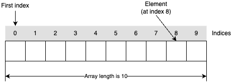
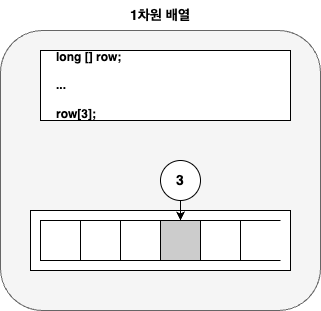
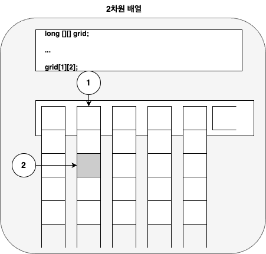
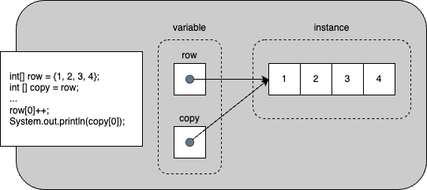
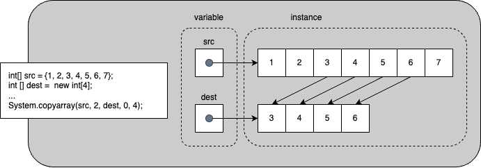

# Language Basics


## Variables


### 종류


#### Instance Variables

* Non-Static Fields
* static modifier 없이 선언된 field
* 각 class의 instance별로 개별 값을 가지며, runtime에 instance가 생성될때 마다 새롭게 생성됨


#### Class Variables

* Static Fields
* static modifier가 선언된 필드
* Compiler에서 class의 instance 개수와 상관없이 하나만 생성함
* final이 추가될 경우,  변경되지 않음


#### Local Variables

* Method에서 선언되어 일시적으로 사용하는 variable
* 별도의 keyword 없음
* 해당 method 내에서만 선언되는 시점에서 부터 사용되며
* 실행이 해당 method를 벗어나면 해지됨


#### Parameters

* Method 호출자와 호출된 method간 상태 공유를 위해 사용

* Method 호출 과정에서 생성됨

* Method가 반환되면서 해지됨

  

### 이름 붙이기

* 하나 이상의 글자(영문자, 숫자, '_', '$') 로 구성
* 첫 번째 글자는 영문자, '_' 또는 '$' 
* 한단어인 경우, 소문자로만 구성
* 두 단어 이상인 경우, lower camel case로 구성
* Constant(상수)와 같이 저장된 값을 사용하는 변수의 경우, 대문자로만 구성
* 예약된 keyword는 사용할 수 없음
  * Abstract, super, boolean, default, if, finally, class, ...
* 잘못된 이름의 경우, compile시 에러 발생


##### Camel case

Camel case 명명 규칙은 이름을 지정할 때 단어를 붙여 쓰되, 단어의 첫번째 첫번째 글자가 대문자로 시작하도록 이름을 지정하는 방법이다.


Camel case 명명 규칙에는 upper camel case와 lower camel case로 구분된다.

이름의 첫번째 글자를 대문자로 표기할 것인가? 소문자로 표기할 것인가에 따라 구분된다.

일부 조직에서는 camel case는 upper camel case를 pascal case로, lower camel case를 camel case로 부르기도 한다.


**Lower camel case**

Method, local variable, field와 parameter에서는 첫 글자가 소문자로 시작하는 lower camel case를 사용하도록 권장한다.

```java
int productCount;
void openDocument() { }
```


**Upper camel case(pascal case)**

Class, interface, enum 등을 선언할 때, 이름 짖는 형식으로 사용된다.

```java
class ProductFactory
```


##### 모두 대문자

상수를 선언할 때, 모두 대문자를 사용해서 선언하도록 권장한다. 

~~~java
static final int MIN_WIDTH = 4;
static final int MAX_WIDTH = 999;
static final int GET_THE_CPU = 1;
~~~


#### 피해야할 이름 짓는 법

* 모든 변수 이름을 대문자로 쓰는 것

* 변수 이름이 '_'로 시작되는 것

* 약어 사용

  


### Primitive Data Types

* Java에서 지원하는 8가지 primitive data type 지원
* 기본 값이 존재하는 data type으로 null이 존재하지 않음
* 정수, 실수, 문자, 논리 리터럴 등의 실제 데이터 값을 저장
* 예약된 keyword를 통해 정의
  * int , long, float, double 등의 예약된 keyword 사용


#### 종류

**byte**

* 부호 있는 정수
* 8 bit
* 최소값 -128
* 최대값 127
* 기본값 0


**short**

* 부호 있는 정수
* 16 bit
* 최소값 -32,768
* 최대값  32,767
* 기본값 0


**int**

* 부호 있는 정수
* 32 bit
* 최소값 -2^31 (-2,147,483,648)
* 최대값  2^31 -1 (2,147,483,647)
* 기본값 0


**long**

* 부호 있는 정수
* 64 bit
* 최소값 -2^63 (-9,223,372,036,854,775,808)
* 최대값  2^63 -1 (9,223,372,036,854,775,807)
* 기본값 0


**char**

* Unicode 문자
* 16 bit
* 최소값 '\u0000' (또는 0)
* 최대값 '\uffff'(또는 65,535)
* 기본값 '\u0000'


**float**

* Single-precision IEEE 754 floating point(단정밀도 IEEE 754 부동 소수점)
* 32 bit
* 최소값 1.175494351 E-38
* 최대값 3.402823466 E+38
* 기본값 0.0f


**double**

* Double-precision IEEE 754 floating point(배정밀도 IEEE 754 부동 소수점)
* 64 bit
* 최소값 2.2250738585072014 E-308
* 최대값 1.7976931348623158 E+308
* 기본값 0.0d


**boolean**

* true와 false 두 가지 값만 사용

* 조건식과 논리 계산에 사용

* 기본값 false

  

#### Literals

* Primitive type을 초기화할 때는 new 를 사용하지 않음
* 고정된 값을 소스 코드 상에서 표현한 것으로 별도의 계산 과정이 없음

~~~java
boolean result = true;
char capitalC = 'C';
byte b = 100;
short s = 10000;
int i = 100000;
~~~


##### Integer Literals

* 정수형은 byte, short, int, long
* long은 구분을 위해 'l' 또는 'L'을 붙여서 사용하며, '1'과 'l'의 구별이 어려으므로 'L' 사용을 권장함
* 10진수를 기본으로 사용
* 16진수로 표기할 경우
  * 앞에 0x 접두사가 붙음
  * 영문자 a-f 또는 A-F가 사용될 수 있으며, 대소문자 구분하지 않음.
* 2진수로 표기할 경우, 앞에 0b 접두사가 붙음


~~~java
// 10진수 26 
int decVal = 26; 
// 16진수 26
int hexVal = 0x1a; 
// 2진수 26 
int binVal = 0b11010;
~~~


##### Floating-Point Literals

* float과 double 두가지 data type이 있으며
* float은 f 또는 F로 끝나고
* double은 d 또는 D로 끝남
* Scientific notation을 위해서 e 또는 E 사용 가능

~~~java
double d1 = 123.4;
// same value as d1, but in scientific notation
double d2 = 1.234e2;
float f1  = 123.4f;
~~~


##### Character(문자) and String(문자열) Literals

* Unicode(UTF-16) 사용

* 문자 표현시 single quotes(작은따옴표) 사용

* Editor나 file system에서 Unicode  편집을 지원하지 않는 경우, unicode escape 사용 가능
  * 문자로 표현 하거나
    *  '\u0108' 
  * 문자열 내에서 사용 가능
    * "S\u00ED Se\u00F1or" (Sí Señor in Spanish)

* 특수 문자를 위한 escape
  * Backspace : '\\b'
  * Tab : '\\t'
  * Line feed : '\\n'
  * Form feed : '\\f'
  * Carriage return : '\\r'
  * Double quote : '\\"'
  * Single Quote : '\\''
  * Backslash : '\\\\'


##### null

  * 모든 reference type에 사용 가능
  * 값의 존재 여부를 나타내는 것 외에는 사용할 경우가 없음


##### Numeric literal에서의 밑줄('_') 사용

* 코드의 가독성을 위해 numeric literal의 숫자 그룹 구분
* 화폐 표기시 일단 단위 기준으로 쉼표(',')를 넣는 것과 같이 그룹 구분
* 실제 값에는 아무런 영향을 주지 않음

~~~java
long creditCardNumber = 1234_5678_9012_3456L;
long socialSecurityNumber = 999_99_9999L;
float pi =  3.14_15F;
long hexBytes = 0xFF_EC_DE_5E;
long hexWords = 0xCAFE_BABE;
long maxLong = 0x7fff_ffff_ffff_ffffL;
byte nybbles = 0b0010_0101;
long bytes = 0b11010010_01101001_10010100_10010010;
~~~


**다음의 위치에는 사용 불가**

* 숫자의 시작 또는 끝
* 부동 소수점에서 소수점 앞뒤
* F, L등의 접미사 앞
* 0x, 0b등의 접두사 사이

~~~java
// Invalid: cannot put underscores
// adjacent to a decimal point
float pi1 = 3_.1415F;
// Invalid: cannot put underscores 
// adjacent to a decimal point
float pi2 = 3._1415F;
// Invalid: cannot put underscores 
// prior to an L suffix
long socialSecurityNumber1 = 999_99_9999_L;

// OK (decimal literal)
int x1 = 5_2;
// Invalid: cannot put underscores
// At the end of a literal
int x2 = 52_;
// OK (decimal literal)
int x3 = 5_______2;

// Invalid: cannot put underscores
// in the 0x radix prefix
int x4 = 0_x52;
// Invalid: cannot put underscores
// at the beginning of a number
int x5 = 0x_52;
// OK (hexadecimal literal)
int x6 = 0x5_2; 
// Invalid: cannot put underscores
// at the end of a number
int x7 = 0x52_;
~~~


 

### Arrays(배열)

* 고정된 수의 단일 type 값을 보유하고 있는 container object
* 길이는 생성시 결정
* Element(요소)라는 항목들로 구성되며, index를 통해서 접근
* Index는 0부터 시작




#### 표기법

배열은 아래와 같은 형식으로 선언한다.


* Data type은 primitive data tye 
* 대괄호([])는 배열을 나타내는 특수 기호
* 배열의 크기는 선언에서 지정하지 않고, 생성시 지정
* 대괄호를 배열 이름의 앞에 선언하는 것을 관례로 권장함

  ~~~java
  byte[] anArrayOfBytes; 
  short[] anArrayOfShorts; 
  long[] anArrayOfLongs; 
  float[] anArrayOfFloats; 
  double[] anArrayOfDoubles; 
  boolean[] anArrayOfBooleans; 
  char[] anArrayOfChars; 
  String[] anArrayOfStrings;
  ~~~


#### 생성

* 변수를 선언한다고 배열이 생성되지 않음.

* 배열은 primitive data type이 아니므로, new를 이용해 생성

  ~~~java
  int [] anArray;
  anArray = new int[10];
  ~~~

* 배열은 생성시 초기값이 주어지지 않을 경우, 기본값으로 설정됨

  


#### 초기화

* 변수를 선언하면서 초기화 할 수 있음
  ~~~java
  int [] anArray = new int[]{1,2,3};
  int [] anArray = {1,2,3};
  ~~~
  * 두 선언은 동일함

    
  
* 생성에서 초기화 시 크기를 지정할 수 없음
  ~~~java
  int [] anArray = new int[3]{1,2,3}; // error
  ~~~


#### 요소에 접근

* 각 배열에 대한 정수 인덱스가 제공됨
* 인덱스는 0에서 시작




#### 다차원 배열

* 1차원, 2차원, 3차원 ... 


##### 생성

* 배열 선언시 대괄호의 개수로 다차원 선언 가능

  ~~~java
  int [][] twoDimensionalArrayOfInts;						// 2차원 배열
  long [][][] threeDimensionalArrayOfLongs;			// 3차원 배열
  String [][][][] fourDimensionalArrayOfStrings;// 4차원 배열
  ~~~

#### 

##### 초기화

* 1차원 배열과 마찬가지로 변수를 선언하면서 초기화 할 수 있음

  ~~~java
  int [][] twoDimensionalArrayOfInts = new int[][]{{1,2,3}, {1,2,3}};
  int [][] twoDimensionalArrayOfInts = {{1,2,3}, {1,2,3}};
  ~~~

  * 두 선언은 동일함

* 생성되어 있던 배열이나 새로운 배열을 생성하여 초기화도 가능

  ~~~java
  int [] anArray = {1,2,3};
  int [][] twoDimensionArrayOfInts = {{1,2,3}, anArray};
  int [][][] threeDimensionArrayOfInts = {towDimensionArrayOfInts, 
                                          {{1,2,3},{1,2}}
                                          new int [2][2]};
  
  ~~~

* 생성에서 초기화 시 크기를 지정할 수 없음

  ~~~java
  int [][] twoDimensionArrayOfInts = new int[2][3]{{1,2,3},{1,2,3}}; // error
  int [][] twoDimensionArrayOfInts = new int[2][]{{1,2,3},{1,2,3}}; // error
  ~~~


##### 요소에 접근

* 각 배열에 대한 정수 인덱스가 제공됨
* 인덱스는 0에서 시작
* 다차원 배열은 배열을 요소로 갖는 배열로서 1차원 배열을 계속해서 따라가는 것과 같다




**문제. 아래의 코드는 compile시 오류가 발생한다. 무엇이 문제인가? 해결 방법은?**

~~~java
public class TestArrays {
  public static void main(String [] args) {
    int [] anArray;
    
    System.out.println("Array[0] : " + anArray[0]);
  }
}
~~~


**문제. 아래의 코드는 compile시 오류가 발생하지 않는다. 무엇이 문제인가? complie시에는 왜 오류가 발생하지 않는가?**

~~~java
public class TestArrays {
  public static void main(String [] args) {
    int [][] twoDimensionalArray;
    
    twoDimensionalArray = new int[10][];
    
    System.out.println("Array[0][0] : " + twoDimensionalArray[0][0]);
  }
}
~~~


**문제. 아래의 코드는 무엇이 같고, 무엇이 다른가? 이유는?**

~~~java
int [][] twoDimensionalArrayOfInts1 = new int[3][2];
int [][] twoDimensionalArrayOfInts2 = {{1,2,3}, {1,2}};
~~~


#### 배열 복사

* 배열을 복사하면 변수만 복사되고 값은 복사되지 않고,두개의 변수가 값은 배열을 가리키게 됨




##### arraycopy

* 배열을 다른 배열에 복사하는 System class에서 지원하는 method

  ~~~java
  public static void arraycopy(Object src, int srcPos, 
                               Object dest, int   destPost, int length);
  ~~~
  
  * src : 복사할 소스 배열
  * srcPos : 복사할 배열의 시작 index
  * dest : 복사할 대상 배열
  * destPost : 대상 배열의 시작 index
  * length : 복사할 요소의 갯수
  
  


#### 조작

* java.util.Array class에서 다양한 배열 조작 기능 제공


**copyOfRange**

* System.arraycopy와 같은 기능을 수행하지만, 대상 배열을 받지 않고 instance를 생성하고 요소를 복사하여 반환

  ~~~java
  public static boolean[] copyOfRange(boolean[] original, int from, int to)
  public static byte[] copyOfRange(byte[] original, int from, int to)
  public static int[] copyOfRange(int[] original, int from, int to)
  ...
  public static String[] copyOfRange(String[] original, int from, int to)
  ~~~


**binarySearch**

* 배열에서 해당 요소를 찾아 그 요소의 index를 반환

  ~~~java
  public static int binarySearch(byte []a, byte key)
  public static int binarySearch(int []a, int key)
  ...
  public static int binarySearch(Object []a, Object key)
  ~~~


**equals**

* 두 배열의 요소들이 동일한지 비교

  ~~~java
  public static boolean equals(byte []a, byte []a2)
  public static boolean equals(int []a, int []a2)
  ...
  public static boolean equals(Object []a, Object []a2)
  ~~~

  

**fill**

* 배열의 모든 요소를 주어진 요소로 채움

  ~~~java
  public static void fill(byte []a, byte val)
  public static void fill(int []a, int val)
  ...
  public static boolean equals(Object []a, Object val)
  ~~~

  

**sort**

* 배열을 오름차순으로 정렬

  ~~~java
  public static void sort(byte []a)
  public static void sort(int []a)
  ...
  public static boolean sort(Object []a)
  ~~~


**stream**

* 주어진 배열을 source로하는 stream 생성

  ~~~java
  public static IntStream stream(int[] array)
  public static LongStream stream(long [] array)
  ...
  public static DoubleStream stream(double [] array
  ~~~


**toString**

* 배열을 이용해 문자열 생성

* 각 요소들을 문자열로 생성하고, 이를 쉼표로 분리한 후 대괄호로 감싸 출력

  ~~~java
  public static String toString(boolean []a)
  public static String toString(int []a)
  ...
  public static String toString(Object []a)
  ~~~

  

### 질문과 답변

//  TODO : 내용 추가


## Operators(연산자)

* 하나, 둘 또는 세개의 operand(피연산자)에 대해 특정 작업을 수행 후 결과를 반환하는 특수 기호


**연산자 우선 순위**

* 표의 위쪽 연산자 우선 순위가 높음

  | 우선 순위 | 종류                 | 연산자                               |
  | --------- | -------------------- | ------------------------------------ |
  | 1         | postfix              | expr++ expr--                        |
  | 2         | unary                | ++expr --expr  +expr -expr ~ !       |
  | 3         | multiplicative       | * / %                                |
  | 4         | additive             | + -                                  |
  | 5         | shift                | << >> >>>                            |
  | 6         | relational           | < > <= => instanceof                 |
  | 7         | equality             | == !=                                |
  | 8         | bitewise AND         | &                                    |
  | 9         | bitwise exclusive OR | ^                                    |
  | 10        | bitwise inclusive OR | \|                                   |
  | 11        | logical AND          | &&                                   |
  | 12        | locigal OR           | \|\|                                 |
  | 13        | ternary              | ? :                                  |
  | 14        | Assignment           | = += -= *= /= %= &= \|= <<= >>= >>>= |


### The Simple Assignment Operator(할당 연산자)

* 오른쪽에 있는 값을 왼쪽에 있는 피연산자에게 할당

  ~~~java
  int cadence = 0;
  long speed = 0;
  byte gear = 1;
  ~~~

* Object 참조를 위해서도 사용

  ~~~java
  int [] anArray = new int [2];
  Point originOne = new Point(100, 100);
  ~~~

  

### The Arithmetic Operators(산술 연산자)

* 일반적으로 알고 있는 더하기, 빼기 등의 사칙 연산을 기본으로 하는 연산자

* 추가로 하나의 피연산자가 나머지 피연산자를 나누고 남은 나머지를 반환하는 나머지 연산자 

  | Operator |  설명  |
  | :------: | :----: |
  |    +     | 더하기 |
  |    -     |  빼기  |
  |    *     | 곱하기 |
  |    /     | 나누기 |
  |    %     | 나머지 |


// TODO : 문제 추가 [ArithmeticDemo](https://docs.oracle.com/javase/tutorial/displayCode.html?code=https://docs.oracle.com/javase/tutorial/java/nutsandbolts/examples/ArithmeticDemo.java)


### The Unary Operators(단항 연산자)

* 하나의 피연산자
* 피연산자를 증가 또는 감소로 변경
* 계산된 값 부호 변경
* 계산된 부울 값 전환


연산자는 아래와 같다.

| Operator | 셜멍                                                         | 피연산자 변경 |
| :------: | ------------------------------------------------------------ | :-----------: |
|    +     | 양수 값을 표현하기 위한 것으로 특별히 사용되지는 않음        |   영향 없음   |
|    -     | 음수 값은 양수 값으로, 양수 값은 음수 값으로 변경하여 출력함 |   영향 없음   |
|    ++    | increment operator(증가 연산자), 피연산자 값을 1 증가 시킴   |    변경됨     |
|    --    | decrement operator(감소 연산자), 피연산자 값을 1감소 기킴    |    변경됨     |
|    !     | 논리 보수 연산자, 부울 값을 반전시킴                         |   영향 없음   |

**예제**

~~~java
class UnaryDemo {

    public static void main(String[] args) {

        int result = +1;
        // result is now 1
        System.out.println(result);

        result--;
        // result is now 0
        System.out.println(result);

        result++;
        // result is now 1
        System.out.println(result);

        result = -result;
        // result is now -1
        System.out.println(result);

        boolean success = false;
        // false
        System.out.println(success);
        // true
        System.out.println(!success);
    }
}
~~~

결과는 아래와 같다.

~~~sh
1
0
1
-1
false
true
~~~


#### The increment/decrement operators

* Increment/decrement operator는 피연산자의 앞 또는 뒤에 붙여서 사용

* 최종 결과는 피연산자 값을 1증가 또는 1 감소 시킴

* 단, 해당 연산자가 적용되는 피연산자가 더 큰 연산에 적용될 경우

  * 앞에 붙으면, 더 큰 연산이 적용되기 전에 단항 연산자가 처리되고
  * 위에 붙으면, 더 큰 연산이 적용된 후에 단항 연산자가 처리됨

**예제**

~~~java
class PrePostDemo {
    public static void main(String[] args){
        int i = 3;
        i++;
        // prints 4
        System.out.println(i);
        ++i;			   
        // prints 5
        System.out.println(i);
        // prints 6
        System.out.println(++i);
        // prints 6
        System.out.println(i++);
        // prints 7
        System.out.println(i);
    }
}
~~~

동작 결과는 아래와 같다. 자신이 생각하는 동작과 일치하는지 확인해 보자.

~~~sh
4
5
6
6
7
~~~


##### 문제. 다음의 결과를 예상해 보고 동작 후 맞는지 확인해 보라.

~~~java
class IncrementTest {
    public static void main(String[] args){
      int [] anArray = {1, 2, 3, 4};
      
      int i = 0;
      int result1 = anArray[++i] + anArray[++i];
      int result2 = anArray[i++] + anArray[i++];

      System.out.println("result1 : " + result1 + ", result2 : " + result2);
    }
}
~~~


##### 문제. result1과 result2의 순서를 변경하였다.  예상되는 결과와 동작 후 맞는지 확인해 보라.

~~~java
class IncrementTest {
    public static void main(String[] args){
      int [] anArray = {1, 2, 3, 4};
      
      int i = 0;
      int result2 = anArray[i++] + anArray[i++];
      int result1 = anArray[++i] + anArray[++i];

      System.out.println("result1 : " + result1 + ", result2 : " + result2);
    }
}
~~~


### The Equality and Relational Operators(관계 연산자)

* 피연산자간의 관계(크거나 작거나 같거나 혹은 다르거나) 결정
* 수학에서는 "="이 같음을 나타내지만, Java에서는 "=="이 같음을 나타냄


관계연산자는 아래와 같다.

| Operator | 설명                                             |
| -------- | ------------------------------------------------ |
| ==       | 두 피연산자가 같음을 확인                        |
| !=       | 두 피연산자가 같지 않음을 확인                   |
| >        | 앞에 연산자가 뒤에 연산자보다 큼을 확인          |
| >=       | 앞에 연산자가 뒤에 연산자보다 크거나 같음을 확인 |
| <        | 앞에 연산자가 뒤에 연산자보다 작음을 확인        |
| <=       | 앞에 연산자가 뒤에 연산자보다 작거나 같음을 확인 |

 

**예제**

~~~java
class ComparisonDemo {

    public static void main(String[] args){
        int value1 = 1;
        int value2 = 2;
        if(value1 == value2)
            System.out.println("value1 == value2");
        if(value1 != value2)
            System.out.println("value1 != value2");
        if(value1 > value2)
            System.out.println("value1 > value2");
        if(value1 < value2)
            System.out.println("value1 < value2");
        if(value1 <= value2)
            System.out.println("value1 <= value2");
    }
}
~~~

결과는 아래와 같다.

~~~shell
value1 != value2
value1 <  value2
value1 <= value2
~~~


// TODO : 문제 확인 할 것

##### 문제. 관계 연산자의 피연산자는 모든 data type이 가능한가? 직접 코드를 작성해 compile 과정에 error가 발생하는지 확인해 보자.

##### 문제. 관계 연산자에 사용되는 두개의 피연산자가 서로 타른 data type일 경우에도 가능한가? 가능하다면, 어떻게 처리될까?


### The Conditional Operators(조건 연산자)

* 두개의 부울 식으로 AND나 OR 연산을 수행

  ~~~java
  class ConditionalDemo1 {
  
      public static void main(String[] args){
          int value1 = 1;
          int value2 = 2;
          if((value1 == 1) && (value2 == 2))
              System.out.println("value1 is 1 AND value2 is 2");
          if((value1 == 1) || (value2 == 1))
              System.out.println("value1 is 1 OR value2 is 1");
      }
  }
  ~~~

  

* Short-circuiting 동작으로 첫번째 피연산자에 의해 결과가 결정된 경우, 두번째 피연산자를 계산하지 않음
  * expression1 && expression2 에서 expression1이 false인 경우, expression2는 계산하지 않음
  * expression1 || expression2에서 expression1이 true인 경우, expression2는 계산하지 않음

  ~~~java
  
  ~~~

#### Shorthand if else (Ternary Operator : 삼항 연산자) 

* If-then-else 문을 식으로 표현

* 세 개의 피연산자가 필요한 삼항 연산자

  

**예제**

~~~java
class ConditionalDemo2 {

    public static void main(String[] args){
        int value1 = 1;
        int value2 = 2;
        int result;
        boolean someCondition = true;
        result = someCondition ? value1 : value2;

        System.out.println(result);
    }
}
~~~

* if-then-else는 뒤에서 배움
* someCondition이 true 인 경우에는 value1을 반환하고, false인 경우에는 value2를 반환
* 따라서 결과는?


#### instanceof

* Object가 피연산자로 주어진 type인지 비교
* Object가 특정한 class의 instance(extends 포함)인지, interface의 implements 인지 확인
* 조건문을 이용해 특정 type에 대한 확인이 필요한 경우 사용

**예제**

~~~java
class InstanceofDemo {
    public static void main(String[] args) {

        Parent obj1 = new Parent();
        Parent obj2 = new Child();

        System.out.println("obj1 instanceof Parent: "
            + (obj1 instanceof Parent));
        System.out.println("obj1 instanceof Child: "
            + (obj1 instanceof Child));
        System.out.println("obj1 instanceof MyInterface: "
            + (obj1 instanceof MyInterface));
        System.out.println("obj2 instanceof Parent: "
            + (obj2 instanceof Parent));
        System.out.println("obj2 instanceof Child: "
            + (obj2 instanceof Child));
        System.out.println("obj2 instanceof MyInterface: "
            + (obj2 instanceof MyInterface));
    }
}

class Parent {}
class Child extends Parent implements MyInterface {}
interface MyInterface {}

~~~

결과는 아래와 같다.

~~~sh
obj1 instanceof Parent: true
obj1 instanceof Child: false
obj1 instanceof MyInterface: false
obj2 instanceof Parent: true
obj2 instanceof Child: true
obj2 instanceof MyInterface: true
~~~

* obj1은 단순 Parent class로서 첫번째 확인에서만 true
* obj2는 Parent class에서 확장하고, MyInterface interface를 구현한 것으로 모든 확인에서 true


// TODO : 문제 추가 필요


### Bitwise and Bit Shift Operators (비트와 비트 shift 연산자)

* 정수 type(byte, short, int, long)에 대해서만 지원
* 정수를 비트 단위로 이동, 반전 또는 설정하는 연산


비트 연산자는 다음과 같다.

| Operator         | 설명                                                         |
| ---------------- | ------------------------------------------------------------ |
| ~                | 단항 연산자로 피연산자의 패턴을 반전 시킴 (0을 1로, 1을 0으로) |
| <<               | 비트 패턴을 왼쪽으로 이동. 오른쪽 새로운 비트 패턴은 0으로 채워짐 |
| >>               | 비트 패턴을 오른쪽으로 이동. 왼쪽 새로운 비트 패턴은 이전 가장 왼쪽 비트 패턴과 동일함 |
| >>>              | 비트 패턴을 오른쪽으로 이동. 왼쪽 새로운 비트 패턴은 0으로 채워짐 |
| &                | 두 피연산자를 비트 단위로 AND 연산을 적용 (1을 true로 0을 false로) |
| ㅣ(vertical bar) | 두 피연산자를 비트 단위로 OR 연산을 적용 (1을 true로 0을 false로) |
| ^                | 두 피연산자를 비트 단위로 XOR 연산을 적용 (1을 true로 0을 false로) |


### Compound Assignment Operators(복합 할당 연산자)

* Assignment operator와 arithmetic operator를 조합하여 산술 연산과 할당을 함께 수행

  * +=, -=, *=, /=, %=

  * 변수에 값을 더하는 연산은 자주 사용된다.

    아래 코드는 int형 변수에 값을 더하는 연산으로 1로 초기화된 변수에 20을 더해 21 로 만든다.

    ```
    int customerCount;
    customerCount = 1;
    customerCount = customerCount + 20;
    ```

  * 합성 할당 연산자를 사용할 수 있습니다

    위의 코드는 하나의 값만 더하므로 복잡하지 않을 수 있다. 아래의 코드를 보자. array의 index를 계산하기 위해 식이 사용되고, 이를 중복해서 여러번 사용되어 복잡하고 오류가 발생할 가능성도 높아진다.

    ```
    array[(i + 1) % 25] = array[(i + 1) % 25] + 20;
    ```

    합성 할당 연산자를 이용해 아래와 같은 단축된 형식으로 동일한 식의 중복 사용을 피할 수 있다.

    ```
    array[(i + 1) % 25] += 20;
    ```
    
  * 산술 연산에 대해 단축된 형식을 사용할 수 있다
  
   ~~~java
   variable += expression; // variable = variable + expression;
   variable -= expression; // variable = variable - expression;
   variable *= expression; // variable = variable * expression;
   variable /= expression; // variable = variable / expression;
   variable %= expression; // variable = variable % expression;
   ~~~
  
   
  
* Assignment operator와 bitwire(or bit shift) operator를 조합하여 비트 연산과 할당을 함께 수행

  * <<=, >>=, >>>=, &=, ^=, |=

  * 비트 연산자에 대해서도 단축된 형식을 사용할 수 있다.
  
    ~~~java
    package examples;
    
    public class TestCompoundOperator {
        public static void main(String[] args) {
            int x = 0xa55a5aa5;
    
            String binaryString = String.format("%32s",
                    Integer.toBinaryString(x)).replace(" ", "0");
            System.out.println("x               : " + binaryString);
            x >>= 1;
            binaryString = String.format("%32s",
                    Integer.toBinaryString(x)).replace(" ", "0");
            System.out.println("x >>= 1         : " + binaryString);
            x <<= 1;
            binaryString = String.format("%32s",
                    Integer.toBinaryString(x)).replace(" ", "0");
            System.out.println("x <<= 1         : " + binaryString);
            x >>>= 1;
            binaryString = String.format("%32s",
                    Integer.toBinaryString(x)).replace(" ", "0");
            System.out.println("x >>>= 1        : " + binaryString);
            x &= -1;
            binaryString = String.format("%32s",
                    Integer.toBinaryString(-1)).replace(" ", "0");
            System.out.println("                : " + binaryString);
            binaryString = String.format("%32s",
                    Integer.toBinaryString(x)).replace(" ", "0");
            System.out.println("x &= -1           " + binaryString);
            x |= 0xa55a5aa5;
            binaryString = String.format("%32s",
                    Integer.toBinaryString(x)).replace(" ", "0");
            System.out.println("x |= 0xa55a5aa5 : " + binaryString);
        }
    }
    
    ~~~
  
    결과는 아래와 같다.
  
    ~~~sh
    x               : 10100101010110100101101010100101
    x >>= 1         : 11010010101011010010110101010010
    x <<= 1         : 10100101010110100101101010100100
    x >>>= 1        : 01010010101011010010110101010010
                    : 11111111111111111111111111111111
    x &= -1           01010010101011010010110101010010
    x |= 0xa55a5aa5 : 11110111111111110111111111110111
    ~~~
  


### 연습 문제


## Expressions, Statements, and Blocks


### Expressions

* 변수, 연산자 및 method 호출등으로 단일 값을 계산해 내는 statement의 일부

* expression에서 반환되는 값은 expression을 구성하는 요소들에 따라 다름

  ~~~ java
  public class ExpressionTest {
      public static void main(String[] args) {
          int x = 2;
          int y = 5;
          int z = 3;
  
          int result1 = x + y / z;
          int result2 = (x + y) / z;
          int result3 = x + (y / z);
  
          if (result1 == result2) {
              System.out.println("+ 연산자는 / 연산자보다 우선 순위가 높다.");
          }
  
          if (result1 == result3) {
              System.out.println("+ 연산자는 / 연산자보다 우선 순위가 낮다.");
          }
      }
  }
  ~~~

  * Expression x = 2 은 "=" 연산자로 구성되어 있고, 결과는 "=" 연산자의 왼쪽 피연산자와 동일한 int
  * Expression result1 == result2는 "==" 연산자로 구성되어 있고, 결과는 "==" 연산자의 결과인 boolean

* 연산자의 우선 순위에 따라 계산

  * 앞에서 배운 연산자 우선 순위에서 / 가 + 보다 높음. 따라서, 두번째 문장이 출력됨
  * 연산자 우선 순위에 따라 계산되어 문제는 없지만, 어느 연산을 먼저해야 하는지 지정해 주는 것이 좋음

  

### Statements

* 완전한 실행 단위

* 다음의 expression을 ';'(세미콜론)으로 끝낸 경우

  * Assignment expressions(대입식)

  * ++ 또는 -- 사용

  * Method 호출

  * 변수 선언 

    // TODO : tutorial에서는 object creation expression을 예로 들었지만, assignment expression과 동일한 내용으로 변경

  ~~~java
  // assignment statement
  aValue = 8933.234;
  // increment statement
  aValue++;
  // method invocation statement
  System.out.println("Hello World!");
  // object declaration statement
  Bicycle myBike;
  ~~~

* Control flow statements(흐름 제어문)

* Block (바로 뒤에 나옴) // TODO : 동작상은 그러한데 맞나?

  

### Blocks

* 0개 이상의 statement를 중괄호({}) 싼 것

* 단일 명령문에 허용되는 모든 곳에서 사용 가능

* Statement와 동일하게 처리 // TODO : 맞나?


**예제**

  ~~~java
  public class BlockTest {
      public static void main(String[] args) { 
          boolean condition = true;
          { // begin block 1
              if (condition) { // begin block 2
                  System.out.println("Condition is true.");
              } // end block one
              else 
                  System.out.println("Condition is false.");
          }
      }
  }
  ~~~

* Block 1 - boolean condition = true; 의 다음 statment 자리에서 사용
* Block 2 - if-then-else 문에서 then 실행문 자리에서 사용


## Control Flow Statements

